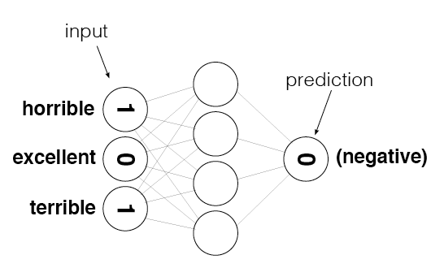

# Sentiment-Analysis-using-Neural-Networks
An Introduction to implementing Sentiment Analysis on Movie Reviews using Neural Network.

The words of a particular review are converted to numbers which are fed as input to the neural network and provides an output of 1 or 0 based on whether the review is POSITIVE or NEGATIVE

training accuracy: 86%  
testing accuracy: 83%
